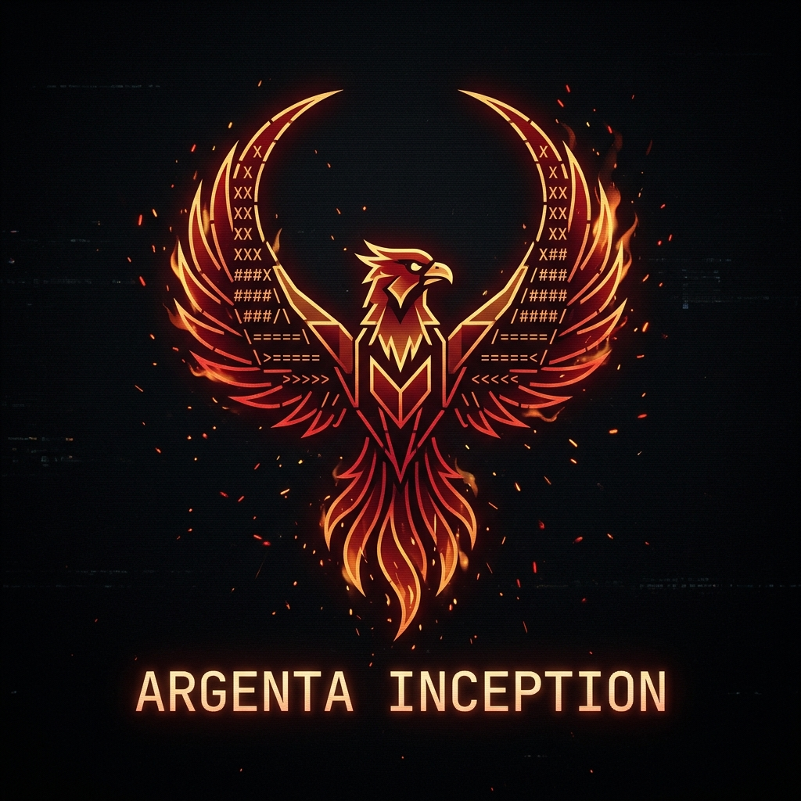
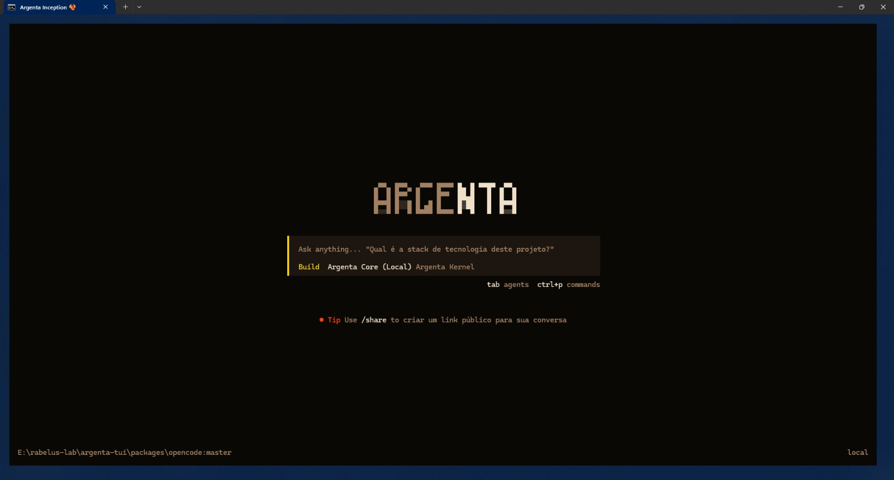

<p align="center">
  
</p>

<h1 align="center">Argenta-Tui</h1>

<p align="center"><strong>Terminal Multi-Agêntico do Rabelus Lab</strong></p>

<p align="center">
  Fork do OpenCode com identidade própria, soluções proprietárias e integração direta com o ecossistema core do Rabelus Lab.
</p>

<p align="center">
  <a href="https://github.com/rabelojunior81-collab/argenta-tui">Repositório Oficial</a>
  ·
  <a href="docs/index.html">Landing GitHub Pages</a>
  ·
  <a href="https://github.com/anomalyco/opencode">OpenCode Upstream</a>
</p>

---

[](docs/index.html)

## O que é

O **Argenta-Tui** é a camada terminal do ecossistema do **Rabelus Lab**: um ambiente multi-agêntico para desenvolvimento assistido por IA, construído sobre a base do OpenCode e expandido com direção própria.

Ele nasce da mesma linhagem técnica que o upstream, mas segue uma trilha autoral em:

- identidade visual Phoenix / Argenta
- narrativa e posicionamento de produto
- integração com o core de ferramentas do Rabelus Lab
- fluxo de distribuição e operação sob a marca `argenta-fenix`

## Posicionamento oficial

O Argenta-Tui se apresenta como:

- **fork com identidade própria**
- **fork com soluções proprietárias**
- **parte integrante do core do Rabelus Lab**
- **membro orgulhoso da comunidade OpenCode**

Não escondemos a origem. Pelo contrário: reconhecemos com respeito a base construída pela comunidade OpenCode e seguimos evoluindo essa linhagem com foco, rebranding e integração de ecossistema.

## O que diferencia o Argenta-Tui

- **Identidade Phoenix**: linguagem visual, branding e atmosfera próprios
- **Terminal first**: foco em operação real via TUI, sem perder extensibilidade futura
- **Ecossistema integrado**: encaixe nativo com os componentes centrais do Rabelus Lab
- **Arquitetura herdada e expandida**: compatibilidade conceitual com OpenCode, mas com direção própria

## Ecossistema Rabelus Lab

O Argenta-Tui não é uma peça isolada. Ele compõe um ecossistema maior de ferramentas unificadas e interligadas, servindo como interface operacional de um núcleo mais amplo do laboratório.

Na prática, isso significa que o TUI é pensado para conversar com outros blocos do stack Argenta, incluindo runtime, gateway, kernel e fluxos de automação do laboratório.

## Relação com o OpenCode

O OpenCode é a nossa base upstream e parte importante da comunidade à qual pertencemos com orgulho.

O Argenta-Tui não tenta apagar essa origem. A proposta é outra:

- honrar a base comunitária
- preservar a transparência técnica
- evoluir uma identidade pública própria
- construir soluções adicionais sob a visão do Rabelus Lab

## Estado atual de distribuição

Hoje, o **ponto público oficial** do Argenta-Tui é este repositório GitHub.

O projeto já possui:

- repositório próprio
- assets oficiais de marca
- landing pública preparada para GitHub Pages

O fluxo de distribuição segue a arquitetura conceitual do OpenCode, mas está sendo consolidado sob a identidade Argenta. Nesta fase, o caminho mais confiável para exploração e desenvolvimento continua sendo o uso direto do repositório.

## Primeiros passos

```bash
git clone https://github.com/rabelojunior81-collab/argenta-tui
cd argenta-tui
bun install
bun run dev
```

Isso inicia a base atual do projeto a partir do código-fonte.

## Direção de produto

O objetivo do Argenta-Tui é se tornar a interface terminal soberana do Rabelus Lab para trabalho multi-agêntico, preservando a potência do OpenCode e levando essa base para uma identidade mais coesa, brasileira, ecossistêmica e proprietária.

## Documentação pública imediata

- `README.md` — landing principal do repositório
- `docs/index.html` — landing preparada para GitHub Pages

## Contribuição

Se você participa da comunidade OpenCode, chega em casa aqui também.

Se você acompanha o Rabelus Lab, o Argenta-Tui é uma das peças centrais dessa construção.

Contribuições, leituras críticas, auditorias de branding e melhorias de operação são bem-vindas dentro da evolução do projeto.

## Reconhecimento

**Com honra à comunidade OpenCode** e com direção própria do **Rabelus Lab**.
